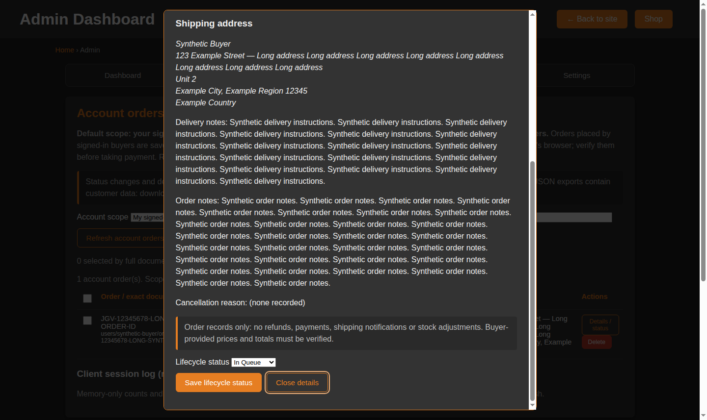
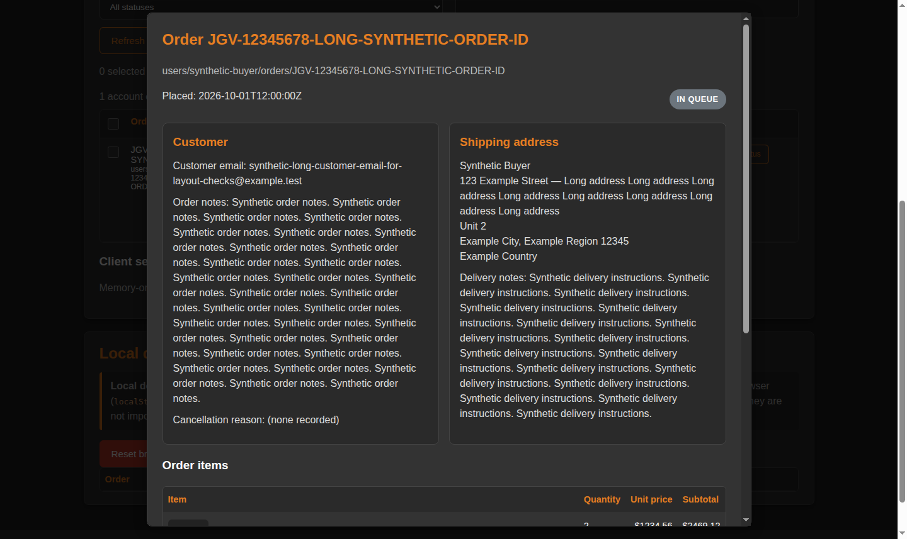
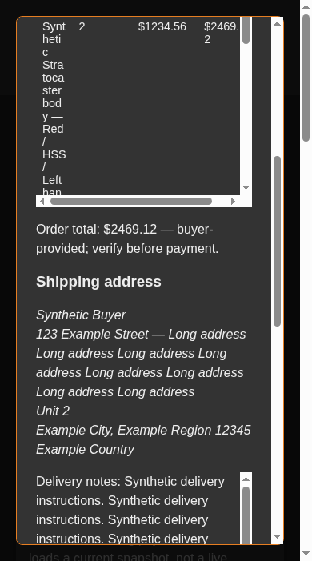
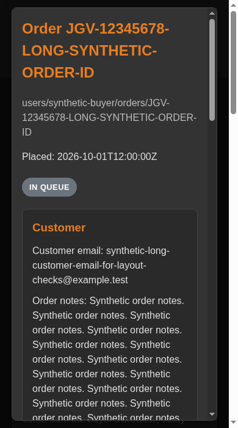

# Testing Notes for Shop/Gallery Enhancements

## Features Tested

### 1. Color Image Swapping ✅
- **Test**: Selected different colors in the color dropdown for products with `color_images` field
- **Expected**: Product image should swap to the corresponding image URL when color is selected
- **Result**: PASS - Image successfully swaps when selecting "White" for Stratocaster Walnut Body (changed from blank to hexagon pattern)
- **Fallback**: If color not in mapping or `color_images` absent, uses main product image

### 2. Product Metadata & Badges ✅
- **Test**: Verified badges display for products with `status` and `tag` fields
- **Expected**: Badges should appear below product title with appropriate colors
- **Result**: PASS - Badges displayed correctly:
  - "New" badge (orange) on Telecaster Ash Body, Jazzmaster Offset Body, Jazzmaster Alder Body
  - "On Sale" badge (red) on Stratocaster SSS Body, Stratocaster Walnut Body
  - "in stock" badge (green) on Stratocaster HSS Body, Stratocaster Walnut Body
  - "made to order" badge (gray) on Modern Telecaster Body
  - "preorder" badge (gray) on Hollow Stratocaster Body

### 3. Discount Pricing ✅
- **Test**: Products with `discount` field should show strike-through original price and sale price
- **Expected**: 
  - Stratocaster Walnut Body: $210.99 → $179.34 (15% off)
  - Jazzmaster Alder Body: $199.99 → $179.99 (10% off)
  - Stratocaster SSS Body: $205.99 → $164.79 (20% off)
- **Result**: PASS - All discount prices calculated and displayed correctly
- **Cart Integration**: PASS - Cart shows discounted price ($179.34) for Stratocaster Walnut Body

### 4. Mini-Cart Indicator ✅
- **Test**: Added item to cart and verified mini-cart count updates across pages
- **Expected**: Badge should show item count, link to cart.html
- **Result**: PASS - Mini-cart displays "1" after adding item, visible on all pages (shop, gallery, index, about, usefullinks)
- **Styling**: Consistent with header buttons, red badge positioned at top-right

### 5. Related Items ✅
- **Test**: Verified related items appear at bottom of product cards
- **Expected**: Show 2-3 items from same category/subcategory
- **Result**: PASS - Related items displayed correctly:
  - Same subcategory items prioritized
  - Clicking related item scrolls to that product and highlights it (orange outline for 2 seconds)
  - All products have relevant related items

### 6. Filtering/Search/Sort ✅
- **Test**: Tested category filter, subcategory filter, search, and sort
- **Expected**: All existing functionality should work unchanged
- **Result**: PASS
  - Category filter: Clicking "Stratocaster" shows only 4 Stratocaster products
  - Subcategory dropdown: Updates based on selected category
  - Products display with all new features (badges, discounts, related items)

### 7. Placeholder Fallback ✅
- **Test**: Verified placeholder.png exists and is used for missing images
- **Expected**: Images with `onerror` handler should fall back to placeholder
- **Result**: PASS - Placeholder exists at `images/placeholder.png`
- **Gallery**: All gallery images load correctly with placeholder fallback support

### 8. Backward Compatibility ✅
- **Test**: Products without new fields (color_images, status, tag, discount) should work normally
- **Expected**: Graceful fallback to existing behavior
- **Result**: PASS - Products without new fields display normally without badges or special pricing

## Sample Data Coverage

### data/shop.csv includes:
- Products WITH color_images: Stratocaster Walnut Body, Stratocaster HSS Body, Modern Telecaster Body
- Products WITH discount: Stratocaster Walnut Body (15%), Jazzmaster Alder Body (10%), Stratocaster SSS Body (20%)
- Products WITH tags: "New", "On Sale"
- Products WITH status: "in-stock", "made-to-order", "preorder"
- Products WITHOUT new fields: Still work correctly (backward compatible)

## Browser Testing
- ✅ Product cards display correctly
- ✅ Color selectors trigger image swaps
- ✅ Add to cart includes discounted prices
- ✅ Toast notifications appear
- ✅ Mini-cart updates in real-time
- ✅ Related items navigation works (smooth scroll + highlight)
- ✅ All existing features preserved (search, sort, filter, subcategories)

## Notes
- All CSV fields are optional - missing fields gracefully fall back to default behavior
- Discount applies before custom color fee in cart
- Related items prioritize same subcategory, then same category
- Mini-cart count updates immediately after adding items
- Stratocaster HSS listings still awaiting real uploaded body images: `strat-hss-cannacaster`, `strat-hss-floweroflife`, `strat-hss-spiralgyroid`, `strat-hss-cts`, `strat-hss-bubbles`, `strat-hss-voronoi`. Their repo folders/assets do not exist yet, so they currently use `images/placeholder.png` until those pattern images are added under their respective `images/Stratocaster/.../HSS/` folders.

## Guest / Account Cart Isolation

### Automated (`npm test`): passing
- `test/cart-store.test.mjs`: guest → A → guest → B → guest, a new empty account, same-account refresh, one-time legacy `jgv3d_cart` → guest migration (never into an account), stale snapshots and writes after an account switch, multi-tab guest updates, two-device concurrent changes, load/save/storage failures with Retry, offline (cache-only) snapshots, item/variant identity, size and quantity limits, and scoped selection.
- `test/cart-pages.test.mjs`: no page reads the old shared `jgv3d_cart` key, every header badge uses `mini-cart.js`, and checkout saves the demo order before removing cart items.
- `test/auth-firebase.test.js`: auth module API (it never touches cart or order storage).

### Not executed in the development sandbox
- `npm run test:rules` (`test/firestore-rules.test.mjs`, Firestore emulator): the emulator download was blocked in the sandbox, so the rules have **not** been run against the emulator yet. Run this locally (Java 11+) before publishing the rules.
- Real Firebase sign-in and Firestore sync on the live site, because the Firebase CDN was unreachable in the sandbox. Follow the checks in FIREBASE_SETUP.md → "Remaining Firebase Console / deployment steps".

### Manual browser walkthrough (local server, fake in-memory backend in place of `cart-firebase.js`)
- PASS: an old `jgv3d_cart` cart showed up as the guest cart (badge 2). A guest add from the shop updated the badge.
- PASS: signing in as A cleared the cart right away ("Loading your account cart…") and then showed an empty account cart. An item added as A appeared only in A's cart.
- PASS: a simulated network failure showed an error with Retry and left the quantity unchanged; Retry then saved the change.
- PASS: signing out brought back the unchanged guest cart. Signing in as B showed an empty cart.
- PASS: guest checkout created a local demo order and then emptied the guest cart.
- Note (pre-existing, unrelated): the first shop card renders with an empty product id, so its "Add to Cart" does nothing. This also happens with the shop page from before this change.

## Admin Dashboard

### Automated (`npm test`): passing
- `test/shop-csv.test.mjs`: the real `data/shop.csv` parses, validates and round-trips; quoting; validation of ids, prices, pipe lists, paths and markup.
- `test/admin-auth.test.mjs`: `isAdmin` sessionStorage cache per UID (TTL, force, clear, errors never cached); activity throttling.
- `test/admin-page.test.mjs`: page gating/redirects, logout/back link, no cart badge, no `innerHTML`/console logging/token storage, account orders (Firestore) and labelled local demo orders.

### Not executed in the development sandbox
- `npm run test:rules` (new admin / userActivity emulator tests in `test/firestore-rules.test.mjs`): the Firestore emulator download was blocked. Run it locally before publishing the rules.
- The live Firebase project and the GitHub API commit were not exercised.

### Manual browser walkthrough (local server, in-memory stand-ins for the Firebase SDK modules)
- Signed out → redirected to `login.html`; non-admin → `login.html?admin=denied` with a message.
- Console-bootstrapped admin → dashboard loads with no cart badge; product add/edit/delete with validation errors; Download CSV produced the expected file.
- User Activity, Orders (read-only account orders from Firestore plus labelled local demo orders, markup shown as text), Settings: invalid email / unknown user / already-admin errors, add and remove admin, remove self → access denied; logout clears the admin cache; 390px-wide layout.

### Admin visual/layout verification

- Order details are the native `order-details-dialog` in `admin.html`, populated by `admin-order-ui.js`, not a separate admin details route.
- `npm test`: 231 passed, 24 emulator tests skipped. Targeted admin page/order tests: 76 passed, including long IDs, synthetic contact/notes, literal HTML-like text, safe local thumbnails/fallbacks, status badges, and two-decimal amounts.
- `npm run test:rules` was attempted but could not start (`firebase: not found`). No rules or schema changes are required for this presentation-only update.
- Headless Chrome at 1440px, 390px, and 320px: checked dashboard, shop, activity, orders, settings, detail/status/cancellation, delete, generic confirmation, and bulk-update layouts. Verified dark controls/fonts, desktop two-column details/mobile stacking, 64px thumbnails, intact prices, page overflow containment, scrollable dialogs, hidden cancellation fields, exact delete-phrase enablement, and Escape/focus restoration.
- Browser checks used the real admin markup with its Firebase-loading inline script omitted. Order UI used injected synthetic read services with writes blocked; other panels used synthetic rows. Loading, empty, and failed reads were exercised. Unit tests cover actual admin controller wiring and mutation confirmations. Live Firebase authorization/writes, payment, GitHub publication, and real device browsers were not exercised.
- All screenshots contain synthetic data only. No production reads/writes or real buyer contact information were used.

| Order details | Before | After |
| --- | --- | --- |
| Desktop |  |  |
| Mobile |  |  |

Scrolled item totals/status actions: [desktop](test/screenshots/admin-layout/after-details-actions-desktop.png), [mobile](test/screenshots/admin-layout/after-details-actions-mobile.png).
